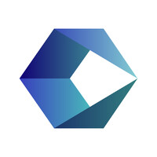

<header>
  <table>
    <tr>
      <td width= "75%">
          
      </td>
      <td width= "25%">
          
      </td>
    </tr>
  </table>
</header>

<body>

  <table>
    <tr width="100%" align="center" display="flex">
      <td colspan="2">
        
        
        
        <!--  -->
        
        
        <!--  -->
        <!--  -->
          &nbsp;&nbsp;&nbsp;&nbsp;&nbsp;&nbsp;
        
        
        
        
         
        
          &nbsp;&nbsp;&nbsp;&nbsp;&nbsp;&nbsp;
        
        
          &nbsp;&nbsp;&nbsp;&nbsp;&nbsp;&nbsp;
        
        
        
        
          &nbsp;&nbsp;&nbsp;&nbsp;&nbsp;&nbsp;
        
          &nbsp;&nbsp;&nbsp;&nbsp;&nbsp;&nbsp;
        
          &nbsp;&nbsp;&nbsp;&nbsp;&nbsp;&nbsp;
        
        
        <!--  -->
      </td>   
    </tr>
    <tr width="100%" align="center">
      <td colspan="2" align="center">
        
 
            
            
            
        

      </td>
    </tr>
  </table>
     
  <table>
    <tr>
        <th class="column-title" colspan="2">🖥️ Work experiences in the technology field</th>
        <th class="column-title">💼 Work experiences in other areas</th>
    </tr>
    <tr>
       <td>
            
        </td>
        <td>
            
        </td>
        <td>
            
        </td>
    </tr>
    <tr>
      <td>
Exp. Time: 1 year and 2 mth's
</td>
      <td>
Exp. Time: 1 year and 7 mth's
</td>
      <td>
Exp. Time: 1 year and 6 mth's
</td>
    </tr>  
    <tr>
        <td><strong>Bilingual Service Desk Agent</strong>   • Night-Shift 12x36</td>
        <td><strong>Service Desk Analyst N1</strong>   • Full-time (Forty hours per week)</td>
        <td><strong>Local Tech Salesperson Leader</strong>   • Full-time (Forty-four hours per week)</td>
    </tr>
    <tr>
        <td>Main Tools Used: <code>Powershell</code>, <code>Service Now</code> , <code>Azure Cloud Entry ID</code> , <code>Active Directory</code> , <code>Microsoft O365</code> , <code>Microsoft W11</code> ,
        <code>Microsoft SCCM</code> ,  <code>Power Automate</code> 
        </td>
        <td>Main Tools Used: <code>Powershell</code>, <code>Microsoft SCCM</code> , <code>Notion</code>, <code>Microsoft O365</code>, <code>Azure Account Services</code>, <code>Remote Access</code></td>
        <td>Main Tools Used: <code>Microsoft Teams</code>, <code>Consultive Sales</code>, <code>Targets Management</code></td>
    </tr>
    <tr>
        <td>Most used Soft Skills: <code>Active English (Call,Mail,Chat) Handling</code> , <code>Active Communication</code>, <code>Troubleshooting</code>, <code>Customer/user service</code></td>
        <td>Most used Soft Skills: <code>Active Communication</code>, <code>Troubleshooting</code>, <code>Customer/user service</code></td>
        <td>Most used Soft Skills: <code>Active Communication</code>, <code>Customer/user service</code>, <code>Mobile Hardware Consultancy</code></td>
    </tr>
    <tr>
        <td>Development Opportunities: <code>Daily English practice</code>, <code>Company UDEMY</code>, <code>Agent chosen for eventual Power Automate flow maintenances </code></td>
        <td>Development Opportunities: <code>Speexx English B1</code>, <code>Atos MyLearning Courses Portal</code>, <code>7° UFN-Atos Java Academy</code></td>
        <td>Development Opportunities: <code>Retail sales knowledge</code></td>
    </tr>
  </table>
     
  <table id="tabela-other"><th colspan="10">Other Sources</th>
      <tr colspan="3" align="center"> 
          <td width="10%">  
            
          </td>
          <td width="10%">  
          
          </td>
          <td width="10%">  
           
          </td>
          <td width="10%"></td>
          <td width="10%"></td>
          <td width="10%"></td>
          <td width="10%"></td>
          <td width="10%"></td>
          <td width="10%"></td>
          <td width="10%"></td>
      </tr>
  </table>
  <table id="tabela-digital-inovation-one"><th colspan="10">Digital Inovation One Bootcamps</th>
      <tr colspan="3" align="center"> 
           <td width="10%">  
            
          </td>
           <td width="10%">  
          
          </td>
          <td width="10%">  
           
          </td>
          <td width="10%">  
         
          </td>
           <td width="10%">
          
          </td>
          <td width="10%">  
            
          </td>
          <td width="10%">  
          
          </td>
          <td width="10%">  
           
          </td>
          <td width="10%">  
           
          </td>
          <td width="10%">  
           
          </td>
      </tr>
  </table>
     
  <table id="tabela-udemy"><th colspan="10">Udemy Courses</th>
      <tr colspan="3" align="center"> 
           <td width="10%">  
             
          </td>
          <td width="10%">  
            
          </td>
          <td width="10%"></td>
          <td width="10%"></td>
          <td width="10%"></td>
          <td width="10%"></td>
          <td width="10%"></td>
          <td width="10%"></td>
          <td width="10%"></td>
          <td width="10%"></td>
      </tr>
  </table>
     
  <table id="tabela-alura"><th colspan="10">Alura Learning Paths</th>
      <tr colspan="3" align="center"> 
          <td width="10%">  
            
          </td>
          <td width="10%">  
            
          </td>
          <td width="10%"></td>
          <td width="10%"></td>
          <td width="10%"></td>
          <td width="10%"></td>
          <td width="10%"></td>
          <td width="10%"></td>
          <td width="10%"></td>
          <td width="10%"></td>
      </tr>
  </table>
</body>  
 

<footer width= "100%" align="center">
  

   
    <!-- 
    
    
    -->
  

  
      <!-- COMMIT SNAKE BY RAFAELA BALLERINI https://www.instagram.com/p/CPjUBhXDNEE/  --->
    <picture width="100%" align="center">
      <source media="(prefers-color-scheme: material-palenight)" srcset="https://raw.githubusercontent.com/Setznagl/Setznagl/output/github-contribution-grid-snake-dark.svg">
      <source media="(prefers-color-scheme: material-palenight)" srcset="https://raw.githubusercontent.com/Setznagl/Setznagl/output/github-contribution-grid-snake.svg">
       
    </picture>
</footer>
